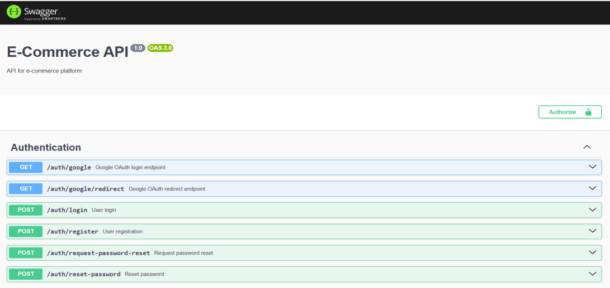

# E-Commerce Platform

## Description

A full-stack e-commerce project featuring:

- **Backend**: NestJS + PostgreSQL + TypeORM
- **Frontend**: React + TypeScript + Vite
- **Auth**: JWT + Google OAuth
- **Features**: Products, Cart, Orders, Chat, Admin Panel, Cron Emails

## Project Structure

```
├── ecommerce-platform/ # Backend (NestJS + TypeORM)
│ ├── src/ # Source code
│ │ ├── admin/ # Admin module
│ │ ├── auth/ # Authentication (JWT & Google OAuth)
│ │ ├── cart/ # Cart module
│ │ ├── chat/ # Real-time chat module
│ │ ├── orders/ # Orders module
│ │ ├── products/ # Products module
│ │ ├── users/ # Users module
│ │ ├── app.module.ts # Root module
│ │ └── main.ts # Application entrypoint
│ ├── test/ # Unit & e2e tests
│ ├── Dockerfile # Backend container config
│ ├── .env # Environment variables
│ └── uploads/ # File upload storage
│
├── frontend/ # Frontend (React + TypeScript + Vite)
│ ├── src/
│ │ ├── api/ # API client modules
│ │ ├── components/ # Reusable React components
│ │ ├── pages/ # Route-level views (Home, Shop, Cart, Admin)
│ │ ├── routes/ # Route definitions (AppRoutes.tsx)
│ │ ├── styles/ # CSS/SCSS modules and global styles
│ │ ├── socket.ts # WebSocket/socket.io logic
│ │ └── main.tsx # Entry point
│ ├── public/ # Static assets (favicon, index.html)
│ ├── Dockerfile # Frontend container config
│ ├── vite.config.ts # Vite build configuration
│ └── tsconfig.json # TypeScript settings
│
├── docker-compose.yml # Orchestrates db, app and frontend containers
└── README.md # Project overview & setup instructions
```

```
-User Registration/login(Google OAuth or email/password)
-Real-time Chat between users
-Role system
-Dockerized setup
-API docs with Swagger ##http://localhost:3000/api/docs#/
```



## Prerequisites

- Node.js ≥16
- Docker & Docker Compose
- Yarn or npm

## Installation

1. Clone repository
   ```bash
   git clone https://github.com/your/repo.git
   cd repo
   ```

## Environment variables

Create a `.env` file in the project root:

| Variable               | Description                                     |
| ---------------------- | ----------------------------------------------- |
| `JWT_SECRET`           | Secret key for signing JWTs (any random string) |
| `SENDGRID_API_KEY`     | SendGrid API key                                |
| `EMAIL_USER`           | Sender email address (e.g. Gmail)               |
| `EMAIL_PASSWORD`       | Email account password or app-specific password |
| `GOOGLE_CLIENT_ID`     | Google OAuth2 Client ID                         |
| `GOOGLE_CLIENT_SECRET` | Google OAuth2 Client Secret                     |
| `GOOGLE_CALLBACK_URL`  | Redirect URL after Google authentication        |
| `DB_HOST`              | PostgreSQL host (e.g. `db` in Docker Compose)   |
| `DB_PORT`              | PostgreSQL port (default: `5432`)               |
| `DB_NAME`              | Database name                                   |
| `DB_USERNAME`          | Database username                               |
| `DB_PASSWORD`          | Database password                               |

## Install dependencies

```
cd ecommerce-platform && yarn install
cd ../frontend && yarn install
```

## Quick Start

```bash
docker-compose up --build
```

## Test

```bash
cd ecommerce-platform
yarn test # unit tests
yarn test:e2e # end-to-end tests
```
